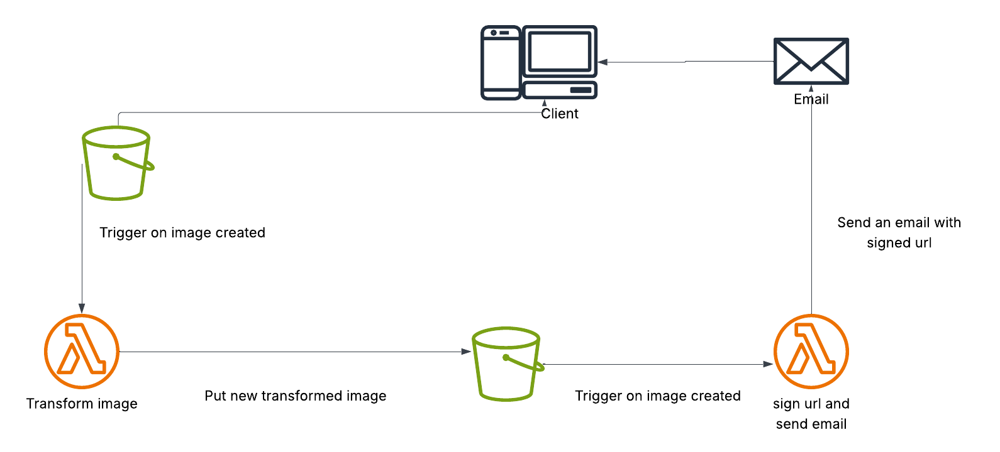

# 📘 AWS Lambda Image Resizer with S3 Trigger (Python)

### ✅ Use Case:

Automatically resize images uploaded to an S3 bucket (to 100x100 px) and store the resized version in a different S3 folder using a Python-based AWS Lambda function.



---

## 📋 1. Requirements

* AWS Account
* S3 Bucket (e.g., `myBucket`)
* Lambda function with Python 3.10
* Pillow installed (via Lambda Layer)
* Proper IAM permissions

---

## 🪣 2. S3 Bucket Setup

Assume:

* Bucket name: `myBucket`
* Upload folder: `saa/source`
* Resized images destination: `saa/destination/`

### ✅ Upload Flow:

1. User uploads to: `myBucket/source/filename.jpg`
2. Lambda resizes and saves to: `myBucket/saa/destination/filename.jpg`

---

## 🧑‍🚀 3. IAM Role for Lambda

### Create an IAM role with the following permissions:

#### Inline Policy:

```json
{
  "Version": "2012-10-17",
  "Statement": [
    {
      "Effect": "Allow",
      "Action": [
        "s3:GetObject",
        "s3:PutObject"
      ],
      "Resource": [
        "arn:aws:s3:::myBucket/saa/source/*",
        "arn:aws:s3:::myBucket/saa/destination/*"
      ]
    }
  ]
}
```

Make sure **no bucket policy contains an `Explicit Deny`** that blocks this role.

---

## 🐍 4. Python Lambda Function Code

### File: `function.py`


---

## 🧱 5. Attach Pillow Layer (Amazon Linux Compatible)

### Step-by-step


in this repo https://github.com/keithrozario/Klayers you can find several ready to use layers for general purposes, I did use pillow package layer from this repo.

Then attach this layer to your Lambda function.

---

## 🧲 6. S3 Event Trigger Setup

1. Go to **S3 → myBucket → Properties → Event Notifications**
2. Add event name: `ImageUploadTrigger`
3. Event type: `PUT` (ObjectCreated)
4. Prefix: `saa/source/`
5. Destination: your Lambda function

---

## 🧪 7. Testing

Upload an image to:

```bash
s3://myBucket/source/test.jpg
```

Lambda will:

* Trigger
* Resize to 100x100
* Upload to:

```bash
s3://myBucket/saa/destination/test.jpg
```

---

## ✅ 8. Final Checklist

| Item                                | Status |
| ----------------------------------- | ------ |
| Lambda function created             | ✅      |
| Proper IAM role attached            | ✅      |
| Pillow layer built for Amazon Linux | ✅      |
| Layer attached to Lambda            | ✅      |
| S3 trigger set up                   | ✅      |
| Image uploaded & processed          | ✅      |

---


# Demo Time


